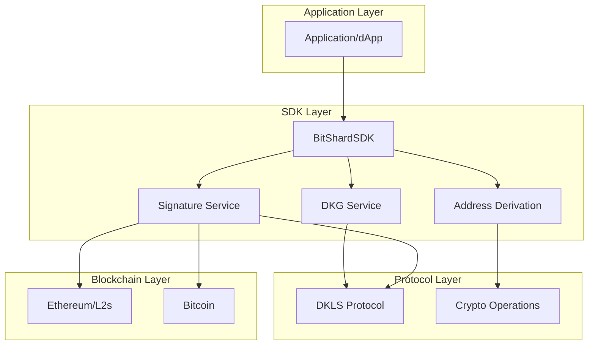
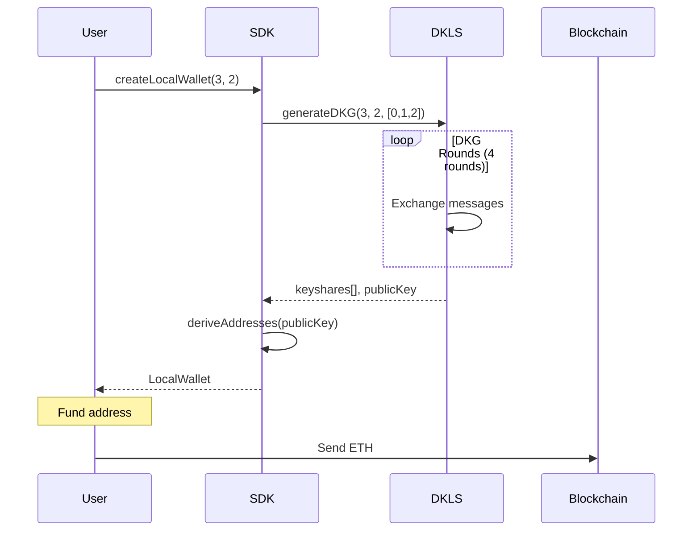
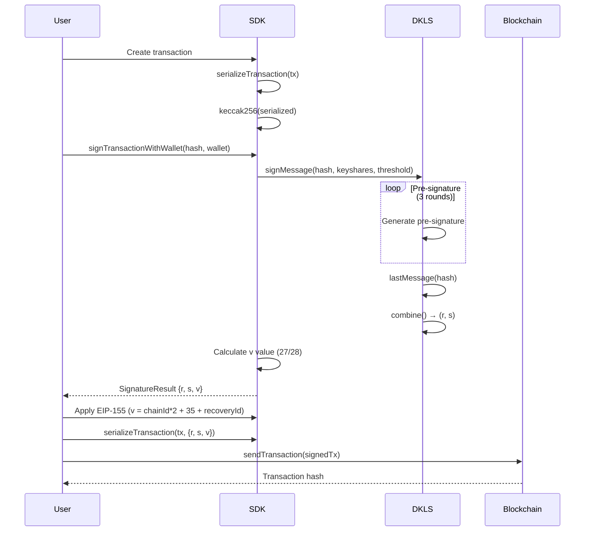

# BitShard SDK Architecture Design

## System Overview

The BitShard SDK implements a complete threshold signature system using the DKLS23 protocol, enabling secure multi-party computation (MPC) wallets with flexible n-of-m configurations.



## Core Components

### 1. BitShardSDK

The main entry point providing high-level APIs:

```typescript
class BitShardSDK {
    // Wallet Management
    createLocalWallet(config): Promise<LocalWallet>
    
    // Signature Operations
    personalSign(message, keyshares, options): Promise<SignatureResult> // options.publicKey required
    personalSignWithWallet(message, wallet, options): Promise<SignatureResult>
    signHash(hash, keyshares, options): Promise<SignatureResult>
    signTransactionWithWallet(hash, wallet, options): Promise<SignatureResult>
    
    // Address Operations
    deriveAddresses(publicKey): BlockchainAddresses
}
```

### 2. DKLSService

Manages the DKLS protocol operations:

```typescript
class DKLSService {
    // Key Generation
    generateDKG(totalParties, threshold, partyIds): Promise<FlexibleDKGResult>
    
    // Signature Generation
    signMessage(messageHash, keyshares, threshold, publicKey?): Promise<SignatureResult>
    
    // Protocol Coordination
    executeDKG(parties): Keyshare[]
    filterMessages(messages, selfId): Message[]
}
```

### 3. Crypto Module

Handles cryptographic operations:

```typescript
// Elliptic Curve Operations
decompressPublicKey(compressed): string  // 33 bytes → 64 bytes
compressPublicKey(uncompressed): string  // 64 bytes → 33 bytes

// Address Derivation
deriveEthereumAddress(publicKey): string  // Keccak256 → address
deriveBitcoinAddress(publicKey): string   // SHA256 → RIPEMD160 → Base58

// Hash Functions
keccak256(data): string  // Ethereum hashing
sha256(data): string     // Bitcoin/general hashing
```

## Data Flow

### Wallet Creation Flow



### Transaction Signing Flow



## Key Algorithms

### Public Key Decompression

For compressed public key (33 bytes) with prefix 0x02 or 0x03:

```
1. Extract x coordinate (32 bytes after prefix)
2. Calculate y² = x³ + 7 (mod p) where p is secp256k1 prime
3. Compute y = √y² using Tonelli-Shanks algorithm
4. If prefix is 0x02 and y is odd, use p - y
5. If prefix is 0x03 and y is even, use p - y
6. Return x || y (64 bytes)
```

### V Value Calculation

```typescript
function calculateV(hash, signature, publicKey) {
    const expectedAddress = deriveAddress(publicKey);
    
    for (v of [27, 28]) {
        const recovered = recoverAddress(hash, {r, s, v});
        if (recovered === expectedAddress) {
            return v;
        }
    }
    return 27; // Default
}
```

### EIP-155 Conversion

```typescript
// Legacy to EIP-155
recoveryId = v - 27;  // 0 or 1
eip155V = chainId * 2 + 35 + recoveryId;

// For Arbitrum Sepolia (chainId = 421614)
// v=27 → eip155V = 843263
// v=28 → eip155V = 843264
```

## Message Formats

### DKLS Wire Message

```typescript
interface WireMessage {
    from_id: number;     // Sender party ID
    to_id?: number;      // Recipient (undefined for broadcast)
    payload: string;     // Base64-encoded message
}
```

### EIP-191 Personal Sign

```
\x19Ethereum Signed Message:\n<length><message>
```

Example:
```
\x19Ethereum Signed Message:\n11Hello World
```

### Transaction Structure

```typescript
interface Transaction {
    to: string;          // Recipient address
    value: BigNumber;    // Wei amount
    data?: string;       // Hex-encoded data
    gasLimit: number;    // Gas limit
    gasPrice: BigNumber; // Gas price in wei
    nonce: number;       // Account nonce
    chainId: number;     // Chain identifier
}
```

## Security Architecture

### Threshold Security Model

```
Total Parties (n) = 3
Threshold (t) = 2

Security Properties:
- Need t parties to sign
- Up to n-t parties can be offline
- No single party has full key
- Key never exists in one place
```

### Message Security

1. **Always Hash Before Signing**
   - Prevents message malleability
   - Ensures fixed-size input
   - Required by DKLS protocol

2. **V Value Verification**
   - Calculate correct recovery ID
   - Verify recovered address matches
   - Prevent signature forgery

3. **Keyshare Protection**
   - Never log keyshares
   - Encrypt at rest
   - Secure transport

## Performance Characteristics

### Operation Timings

| Operation | Time | Notes |
|-----------|------|-------|
| DKG (3 parties) | 2-3s | One-time per wallet |
| Sign (2-of-3) | 500ms | Includes v calculation |
| Address derivation | <10ms | Cached after first |
| Public key decompression | <5ms | Elliptic curve math |

### Gas Costs (Arbitrum Sepolia)

| Transaction Type | Gas Used | Cost @ 0.1 gwei |
|-----------------|----------|-----------------|
| Simple transfer | 21,000 | 0.0000021 ETH |
| With 32 bytes data | ~23,200 | 0.0000023 ETH |
| With 100 bytes data | ~27,800 | 0.0000028 ETH |

## Network Architecture

### Local Mode (Testing)

All parties in single process:
```
Process
├── Party 0 (Keyshare 0)
├── Party 1 (Keyshare 1)
└── Party 2 (Keyshare 2)
```

### Distributed Mode (Production)

```
┌─────────────┐     WebSocket      ┌─────────────┐
│   Party 0   │◄──────────────────►│ Coordinator │
│  (Server)   │                    │   Server    │
└─────────────┘                    └──────┬──────┘
                                          │
┌─────────────┐                           │
│   Party 1   │◄──────────────────────────┘
│  (Mobile)   │
└─────────────┘

┌─────────────┐
│   Party 2   │◄──────────────────────────┘
│  (Browser)  │
└─────────────┘
```

## Storage Requirements

### Per Wallet

```
Public Key:     33 bytes (compressed)
Keyshare:      ~200 bytes (per party)
Metadata:       ~100 bytes
─────────────────────────
Total:         ~333 bytes per party
```

### Transaction Signature

```
R value:        32 bytes
S value:        32 bytes
V value:         1 byte
─────────────────────────
Total:          65 bytes
```

## Error Handling Strategy

### Retry Logic

```typescript
async function signWithRetry(hash, keyshares, maxRetries = 3) {
    for (let i = 0; i < maxRetries; i++) {
        try {
            return await sign(hash, keyshares);
        } catch (error) {
            if (i === maxRetries - 1) throw error;
            await sleep(1000 * Math.pow(2, i)); // Exponential backoff
        }
    }
}
```

### Error Recovery

1. **Network Failures**: Automatic reconnection with exponential backoff
2. **Invalid Signatures**: Recalculate v value and retry
3. **Insufficient Gas**: Estimate gas dynamically
4. **Nonce Issues**: Fetch fresh nonce from chain

## Testing Strategy

### Unit Tests
- Crypto operations (compression, hashing)
- Address derivation
- Message formatting

### Integration Tests
- Full DKG ceremony
- Signature generation and verification
- Transaction signing and broadcasting

### E2E Tests
- Complete wallet lifecycle
- Real testnet transactions
- Balance monitoring

## Deployment Considerations

### Environment Variables

```bash
# Network Configuration
ARBITRUM_SEPOLIA_RPC=https://sepolia-rollup.arbitrum.io/rpc
CHAIN_ID=421614

# Optional Custom Message
TX_MESSAGE="Custom transaction message"

# Gas Settings
GAS_PRICE_MULTIPLIER=1.1  # 10% buffer
```