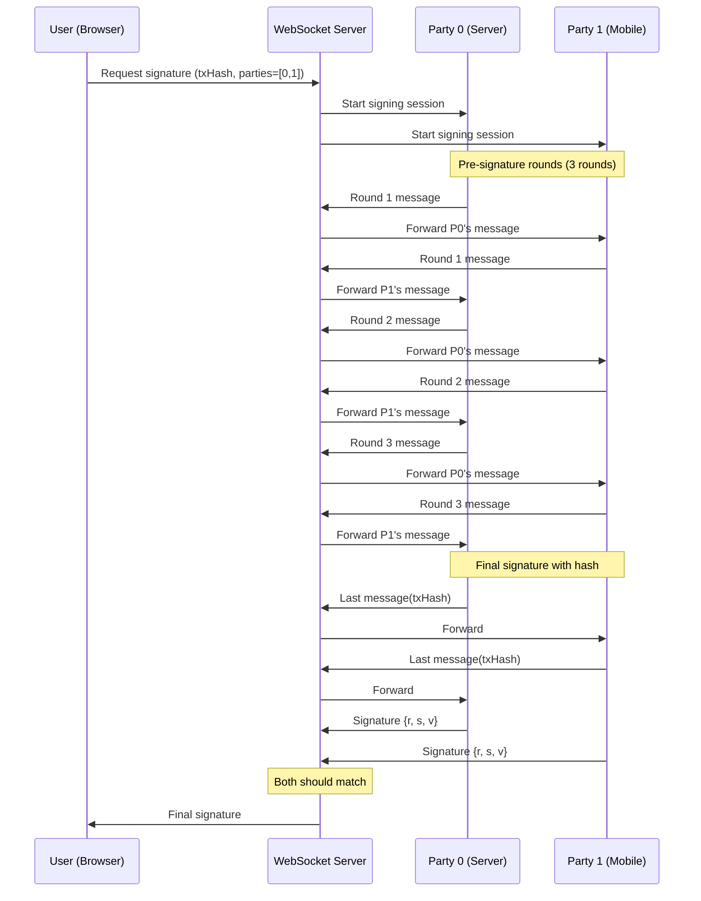

```mermaid
sequenceDiagram
    participant User as User (Browser)
    participant WS as WebSocket Server
    participant P0 as Party 0 (Server)
    participant P1 as Party 1 (Mobile)
    
    User->>WS: Request signature (txHash, parties=[0,1])
    WS->>P0: Start signing session
    WS->>P1: Start signing session
    
    Note over P0,P1: Pre-signature rounds (3 rounds)
    P0->>WS: Round 1 message
    WS->>P1: Forward P0's message
    P1->>WS: Round 1 message
    WS->>P0: Forward P1's message
    
    P0->>WS: Round 2 message
    WS->>P1: Forward P0's message
    P1->>WS: Round 2 message
    WS->>P0: Forward P1's message
    
    P0->>WS: Round 3 message
    WS->>P1: Forward P0's message
    P1->>WS: Round 3 message
    WS->>P0: Forward P1's message
    
    Note over P0,P1: Final signature with hash
    P0->>WS: Last message(txHash)
    WS->>P1: Forward
    P1->>WS: Last message(txHash)
    WS->>P0: Forward
    
    P0->>WS: Signature {r, s, v}
    P1->>WS: Signature {r, s, v}
    
    Note over WS: Both should match
    WS->>User: Final signature
```